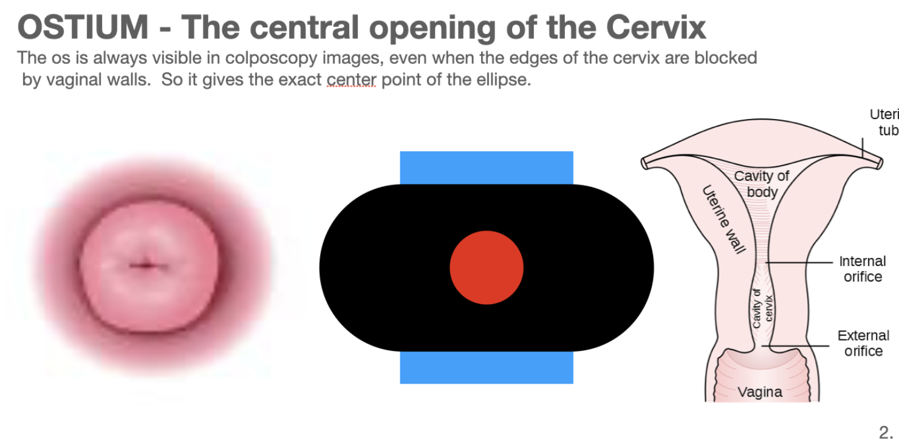
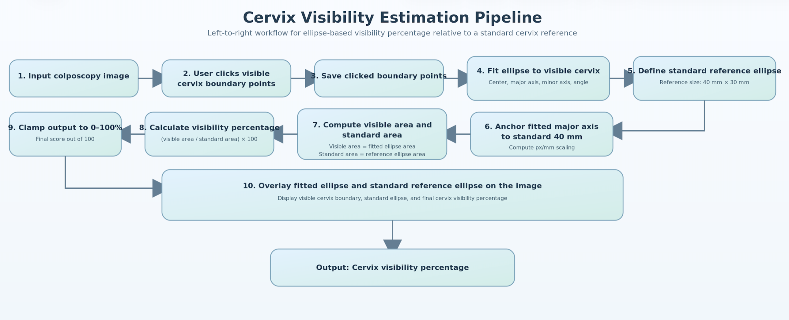
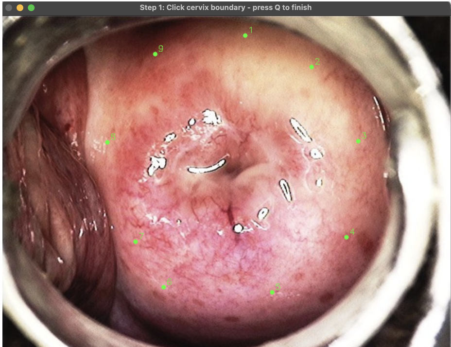
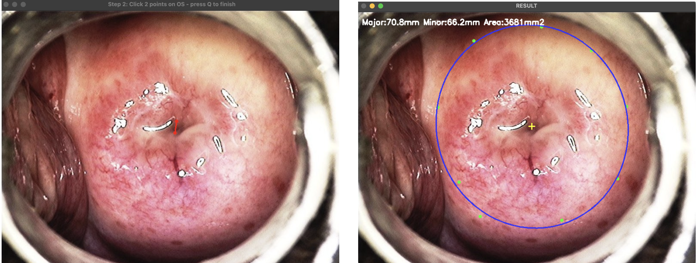
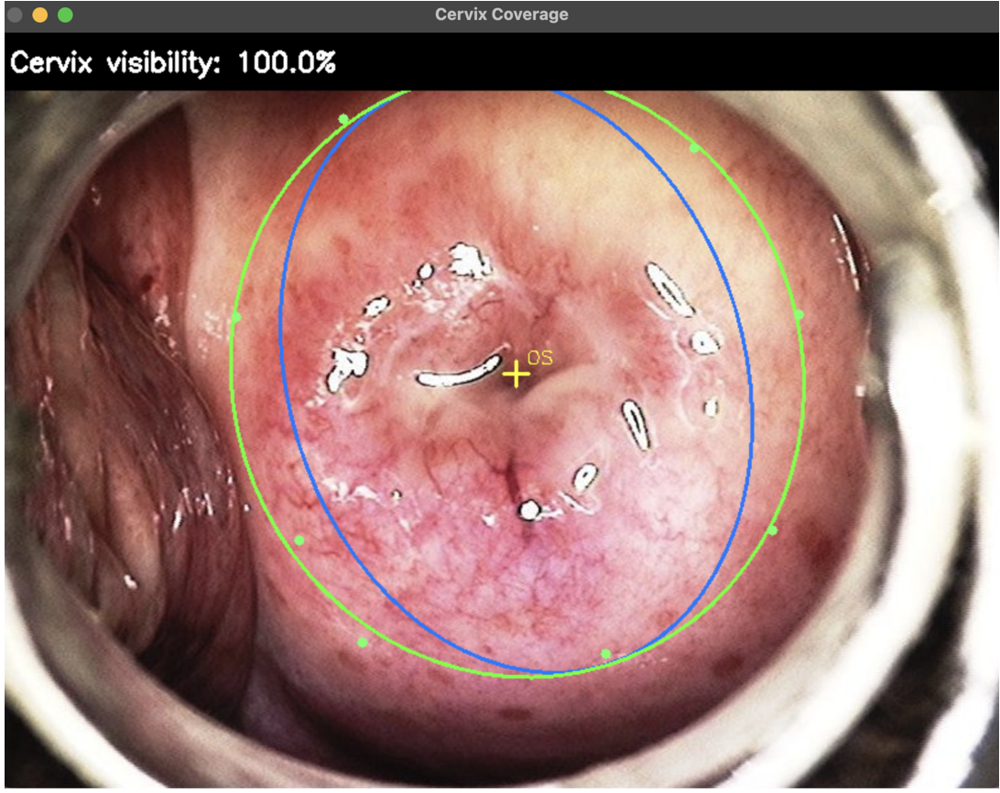
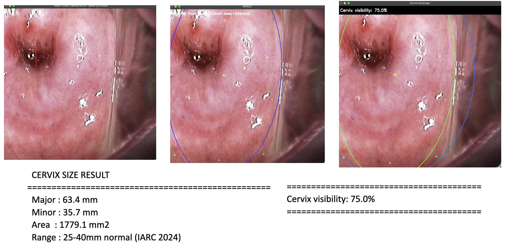

<h2 align="center">Cervix Size Estimation from Colposcopy Images</h2>

  A three-step image processing pipeline to estimate the real anatomical size and visibility
  percentage of the cervix from standard colposcopy images — even when only partially visible.

<h3>🧠 Overview</h3>

  

Cervical cancer is the fourth most common female malignant tumour worldwide.
In colposcopy, the cervix is often only partially visible, making it difficult to
assess the full anatomical extent of lesions. This project estimates the true
cervix size and percentage visibility directly from colposcopy images using
ellipse fitting, OS-based calibration, and grid-based coverage analysis.

<h3>⚙️ Pipeline</h3>

  

<table>
  <tr><th>Step</th><th>Script</th><th>Description</th><th>Output</th></tr>
  <tr>
    <td>1</td>
    <td><code>step1_boundary.py</code></td>
    <td>User clicks points along the visible cervix boundary. Points are drawn and saved for ellipse fitting.</td>
    <td><code>boundary_points.npy</code></td>
  </tr>
  <tr>
    <td>2</td>
    <td><code>step2_ellipse.py</code></td>
    <td>User clicks 2 points on the cervical OS. Fitzgibbon's ellipse fitting (cv2.fitEllipse) reconstructs the full cervix boundary. OS diameter (≈4mm) calibrates pixels→mm conversion.</td>
    <td><code>cervix_result.jpg</code></td>
  </tr>
  <tr>
    <td>3</td>
    <td><code>step3_coverage.py</code></td>
    <td>Computes cervix visibility % = (patient area / standard 40×30mm reference area) × 100. Overlays standard reference ellipse (orange) and visible ellipse (green) on image.</td>
    <td><code>cervix_coverage_result.jpg</code></td>
  </tr>
</table>

<h3>🔬 Method Details</h3>

<h4>Step 1 — Boundary Annotation</h4>

  

The user clicks ≥5 points along the visible arc of the cervix boundary.
Each click is stored as a coordinate and saved to <code>boundary_points.npy</code>.
A minimum of 5 points is required for Fitzgibbon's algorithm.

<h4>Step 2 — OS Measurement + Ellipse Fitting</h4>

  

The cervical OS (external opening) is used as an in-image ruler.
Normal OS diameter ≈ 3–5mm (clinical range); 4mm is used as the calibration value.
<code>cv2.fitEllipse()</code> applies Fitzgibbon's direct least-squares algorithm to reconstruct
the full ectocervix boundary from the clicked points.
Major diameter, minor diameter, and area are computed in mm and mm².
Normal range: 25–40mm (IARC 2024).

<h4>Step 3 — Percentage Coverage</h4>

  

<pre><code>Visibility % = (patient ellipse area / standard 40×30mm area) × 100
</code></pre>

Standard reference: 40mm × 30mm (IARC/clinical normal adult cervix range).
The standard ellipse (orange) and patient ellipse (green) are overlaid on the image.
Result is capped at 100%.

<h3>📊 Results</h3>

  

<pre><code>Sample 1:
  Major: 76.9 mm | Minor: 54.9 mm | Area: 3318.9 mm²
  Visibility: 97.8%

Sample 2:
  Major: 63.4 mm | Minor: 35.7 mm | Area: 1779.1 mm²
  Visibility: 75.0%
</code></pre>

<h3>🗂️ Repository Structure</h3>
<pre><code>cervix-estimation/
├── step1_boundary.py        ← boundary point annotation
├── step2_ellipse.py         ← OS calibration + ellipse fitting
├── step3_coverage.py        ← visibility percentage estimation
├── intro.png
├── flowchart.png
├── step1.png
├── step2.png
├── step3.png
├── result.png
└── README.md
</code></pre>

<h3>▶️ How to Run</h3>
<h4>Install dependencies</h4>
<pre><code>pip install opencv-python numpy</code></pre>

<h4>Run in order</h4>
<pre><code>python step1_boundary.py    # Click cervix boundary points → saves boundary_points.npy
python step2_ellipse.py     # Click OS points → fits ellipse → saves cervix_result.jpg
python step3_coverage.py    # Computes visibility % → saves cervix_coverage_result.jpg
</code></pre>

<h3>📷 Dataset</h3>

Cervix images sourced from the
<a href="https://screening.iarc.fr/atlascolpodiag_list.php">IARC Atlas of Colposcopy Diagnosis</a>
— an open-access colposcopy image atlas provided by the WHO/IARC Cancer Screening Programme.

<h3>📄 References</h3>
<ol>
  <li>Fitzgibbon, A., Pilu, M., & Fisher, R. B. (1999). <i>Direct least square fitting of ellipses.</i> IEEE Transactions on Pattern Analysis and Machine Intelligence, 21(5), 476–480.</li>
  <li>IARC (2024). <i>Colposcopy Manual: Anatomy of the Uterine Cervix.</i> WHO/IARC Cancer Screening Programme.</li>
  <li>Hill, D. A., Cacciatore, M. L., & Lamvu, G. (2014). <i>Sheathed versus standard speculum for visualization of the cervix.</i> International Journal of Gynecology and Obstetrics, 125(2), 116–120.</li>
  <li>AnnoCerv — <a href="https://github.com/iclx/AnnoCerv">https://github.com/iclx/AnnoCerv</a></li>
</ol>
